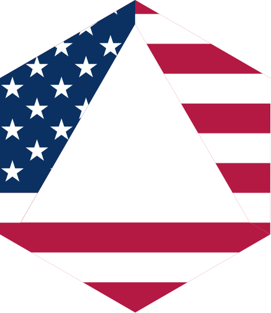

# GovQL
## Making Government Data Available in GraphQL

Lots of government data is available, but that doesn't mean it's easy to access
and extract insights from it. This project is an attempt to rectify that.

## Prerequisites:

1. You need [dotenvx](https://dotenvx.com/docs/install) to manage secrets.
2. You need to have Docker running.

## Instructions:

1. Make sure Docker is running.
2. `dotenvx run -- docker compose up --build -d`
3. That's it.